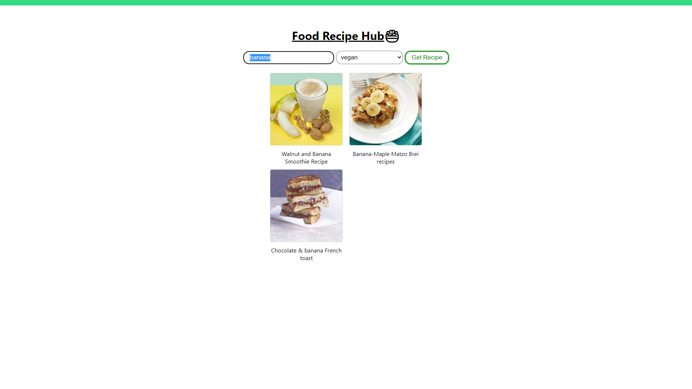

# React App
## ```Food Recipe Web Application - React.js, Edamam API CSS```

>Main Page


>This is a react app for finding recipes for different dishes.

>Just enter an ingredient or dish name in the search field and click on the search button.

>Then go by clicking on the picture of the dish in order to find out the recipe.

####Happy search and new tastes!


